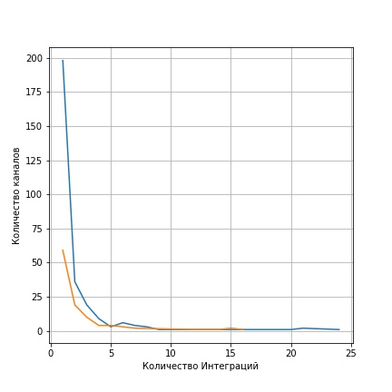

# Хакатон: Обработка данных
## Цель: 
Найти инсайты по данным о продвижении у блогеров
## Исходные данные.
Исходные данные предоставлены в виде google таблицы, содержащей три листа. На первом листе приведены данные по итогам продвижения курсов обучения у блогеров. На втором листе предоставлена характеристики включения рекламы в каналы блогеров. На третьем листе предоставлена общая информация.
 ## Ход работ.
 1. Проведена предобработка исходных данных с объединением информации с листа 1 и листа 2 исходных данных.
 2. Проведен анализ данных.
 ## Анализ данных.
 Анализ данных проведен по следующим критериям:
 1. Влияние наименование канала на основные показатели успешности продвижения;
 2. Влияние даты начала продвижения на основные показатели успешности продвижения;
 3. Влияние времени включения в контент на показатели успешности продвижения;
 4. Влияние наличия скидки и огранияений на ее продолжительность.
 ### Влияние наименования калала.
 Анализ показал, что в исходных данных представлено 285 каналов с различной долей участия в продвижении. Распределение величины количества каналов от величины количества использовании канала показано на рисунке 1 (Линия синего цвета). 
 
>>>>>>>>Рисунок 1

Дополнительно на рисунке 1 показан график распределение величины количества каналов, которые принесли прибыль, от величины количества использовании канала (Линия ораньжевого цвета). Из рисунка 1 видно, что наибольшее число каналов использовалось для продвижения 1 раз, при этом примерно только 30% из них принесли прибыль.
Рассмотрим перечень каналов, прибыль от которых была получена 4 и более раз. Общие характеристики успешности продвижения приведены на рисунках 2 - 5.

>>>>>>>>Рисунок 2

>>>>>>>>Рисунок 3

>>>>>>>>Рисунок 4

>>>>>>>>Рисунок 5

Из рисунка 5 видно, что канал с названием "Dmitry Puchkov" имеет максимальный коэффициент возврата инвестиций, при этом у него не максимальные показатели C1 и C2.

На рисунке 6 показана суммарнвя величина приболи от не рассмотренных ранее каналов

>>>>>>>>Рисунок 6

Из рисунка 6 видно, что итоговая величина приболи от каналов с участием в продвежении менее 4 раз превышает расходы.

### Влияние даты начала продвижения.

На рисунке 7 показано влияние даты начала продвижения на величину прибыли.

>>>>>>>>Рисунок 7

Из рисунка 7 видно резкий подъем с апреля месяца 2020 г., что скорее всего связано с характером 2020 г. (Covid) и не является тенденцией.

На рисунке 8 показано влияние дня недели включения в контент на величину прибыли.

>>>>>>>>Рисунок 8

Из рисунка 8 видно, что максимальная прибыль от продвижения приходит от контента с днем размещения рекламы в четверг и вторник, меньше всего - понедельник.

### Влияние времени включения в контент

На рисунке 9 показано влияние времени включения в контент на величину прибыли.

>>>>>>>>Рисунок 9

Максимальная величина приболи фиксируется при включении рекламы в конец контента.

### Влияние наличия скидки и огранияений на ее продолжительность

На рисунке 10 показана величина приболи от контента при наличии скидки.

>>>>>>>>Рисунок 10

Из рисунка 10 видно, что делать скидку более 50% не рентабельно. 

На рисунке 11 показано влияние наличия ограничения по продолжительности скидки на величину прибыли от размещения рекламы в контенте.

>>>>>>>>Рисунок 11

На рисунке 11 показано влияние наличия ограничения по продолжительности скидки на величину прибыли от размещения рекламы в контенте.

На рисунке 12 показано влияние продолжительности по времени действия скидки на величину прибыли от размещения рекламы в контенте.

>>>>>>>>Рисунок 12

Из рисунка 12 видно, что продолжительность действия скидки нужно делать не более 30 дней.