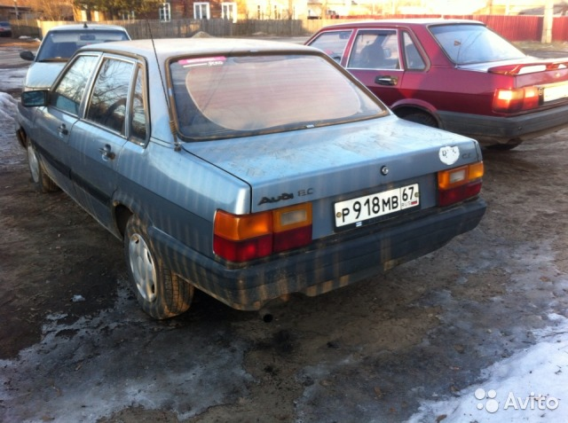
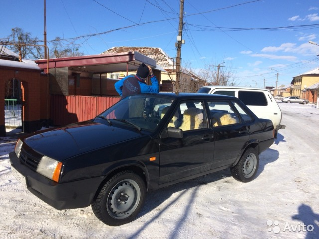

# Module_6 
## Car classification
### Исходные данные:
1. Работа выполнена на онлайн-площадке Kaggle. Особенность площадки - работа GPU 38 часов в неделю;
2. В качестве baseline был взят dataset ["Baseline Keras Xception [Car class] v.2.0"](https://www.kaggle.com/itslek/baseline-keras-xception-car-class-v2-0) , автор: "Alex Lekov";
3. В базовом dataset были включены следующие данные:
    - файл sample-submission.csv, который содержит перечень изображений машин для классификации;
    - архив test.zip, который содержит изображения в формате *.jpg для классификации;
    - файл train.csv, который содержит перечень изображений машин для обучения с принадлежностью к определенному классу;
    - архив train.zip, содержащий изображения в формате *.jpg для обучения. Изображения сгруппированы по отдельным папкам в соответствии с классом.
4. В базовом dataset представлено решение задачи по классификации модели автомобиля по изображению. Классификация основана с применением метода Transfer Learning. В качестве базовой модели выбрана сеть Xception, обученная на базе данных ImageNet и дообученная под конкретную задачу.
5. Данные для обучения и классификации разделяются на следующие классы:
    - Class 0 - Lada Priora;
    - Class 1 - Ford Focus;
    - Class 2 - Lada 2114;
    - Class 3 - Lada 2110;
    - Class 4 - Lada 2107 (может 2105);
    - Class 5 - Lada Niva;
    - Class 6 - Lada Kalina;
    - Class 7 - Lada 2109;
    - Class 8 - Volkswagen Passat;
    - Class 9 - Lada 21099

### Базовый dataset:
В базовом dataset представленна модель на основе базовой модели Xception с следующими дополнительными слоями:
+ GlobalAveragePooling2D() - слой объединения пространственных данных способом поиска глобального среднего;
+ Dense(256, activation = 'relu') полносвязный слой, имеющий размерность на выходе 256;
+ Dropout(0.25) с вероятностью 25% на каждом шаге back propagation обнуляет нейрон, а 75% случаев - оставляет без изменений;
+ Dense(CLASS_NUM, activation='softmax') полносвязный слой, на выходе размерность CLASS_NUM, соответствующий количеству классов в решаемой задаче, функция activation = "softmax" позволяет подсчитывать вероятность принадлежности изображения к классам.

Базовое решение дает точность на тестовой выборке - 90,73%.
Из графиков изменения точности решения от эпохи "Training and validation accuracy" видно, что после 3 эпохи точность решения модели на тестовых данных начинает падать. Это может свидетельствовать о тенденции модели к переобучению или потери минимума.
### Работа над моделью.
#### EDA/Анализ данных.
Выборочный анализ данных показал наличие ошибок в разметке данных для обучения. Так для изображения 252915.jpg  указан класс 7 (Lada 2109), но на изображении показан автомобиль марки Audi. 

Ошибочно назначен класс для изображений 291001.jpg и 245594.jpg. 

< Присвоен Class 7. Нужно заменить на Class 9.>

< Присвоен Class 3. Нужно заменить на Class 2.>

При разметке данных я бы разделил автомобили принадлежащие к Class 0, Class 1, Class 6, Class 8 по типам кузова.
#### Ход работы:
Работа над моделью проведена на платформе Kagle. Ссылка: https://www.kaggle.com/demidovmp/car-classification-xception-demidov

##### Version 1.
Изменения:
1. В функцию callback обучения добавлена функция изменения величины Learning Rate CLR (Cyclical Learning Rate). Информация взята с https://github.com/bckenstler/CLR. Включение в работу проведено копированием class CyclicLR(Callback) в тело notebook.
2. К модели добавлен полносвязный слой Dense с размерностью на выходе равной 126 нейронамб, слой Dropout и слой BatchNormalization (обеспечивает нормализацию выходов нейронной сети при back propagation).
3. Обучена проведено на 5 эпохах.

Точность на тестовой выборке составила - 91,88%.
При расчете модели не был изменен базовая величина learning rate, установленная в class CyclicLR(Callback).

В графиках изменения точности решения от эпохи "Training and validation accuracy" тенденция снижения точности решения модели на тестовых данных сохранилась.

##### Version 2.
Изменения:
1. Добавлена augumentation на основе библиотеки Albumentation.
2. Изменены слои модели:
    - model = M.Sequential()
    - model.add(base_model)
    - model.add(L.GlobalAveragePooling2D())
    - model.add(L.BatchNormalization())
    - model.add(L.Dense(256, activation = 'relu'))
    - model.add(L.Dropout(0.25))
    - model.add(L.Dense(CLASS_NUM, activation='softmax')).
3. Увеличино количество эпох для расчета до 15.
4. Изменена величина learning rate в class CyclicLR(Callback).

Точность на тестовой выборке составила - 94,14%.

Из графиках изменения точности решения от эпохи "Training and validation accuracy" видно, что график точности на тестовых данных имеет тенденцию к возрастанию, но меняется скачками, что говорит о не способности модели найти минимум из-за величины learning rate (выскакивает из минимума).

##### Version 3.
Изменения:
1. Модель:
    - model = M.Sequential()
    - model.add(base_model)
    - model.add(L.GlobalAveragePooling2D())
    - model.add(L.BatchNormalization())
    - model.add(L.Dense(256, activation = 'relu'))
    - model.add(L.Dropout(0.25))
    - model.add(L.Dense(128, activation = 'relu'))
    - model.add(L.Dropout(0.25))
    - model.add(L.Dense(CLASS_NUM, activation='softmax'))
2. Добавлен метод Fine Tuning состоящию из двух шагов. На первом шаге замораживаем 20% слоев базовой модели, обучаем модель (15 эпох). На втором шаге размораживаем всю модель и дообучаем с уменьшенным learning rate (уменьшен в 10 раз от базового).

Точность на тестовой выборке составила - 94,27%.

##### Version 4.
Изменения:
1. Добавлен шаг 3 Fine Tuning. Дообучается вся модель при уменьшенном learning rate;
2. Модель прошла 11 эпох обучения на первом шаге Fine Tuning.
3. Добавлен Test-time augmentation при формировании submission.

Точность на тестовой выборке составила - 94,72%.

##### Version 5.
Изменения:
1. Заменена базовая модель на EfficientNetB6.
2. Модель:
    - model = M.Sequential()
    - model.add(base_model)
    - model.add(L.GlobalAveragePooling2D())
    - model.add(L.BatchNormalization())
    - model.add(L.Dense(256, activation = 'relu'))
    - model.add(L.Dropout(0.25))
    - model.add(L.Dense(CLASS_NUM, activation='softmax'))
3. На первом шаге Fine Tuning базовая модель была заморожена полностью для обучения, learning rate - 1e-3, 5 эпох.
4. Шаг 2 Fine Tuning, заморожено 50% слоев базовой модели, learning rate - 1e-4, 15 эпох.
5. Шаг 3 Fine Tuning, все слои базовой модели разморожены для обучения, learning rate - 1e-5, 5 эпох.
6. Уменьшен размер BATCH_SIZE (ошибка при обучении - мало памяти). 

Точность на тестовой выборке составила - 93,99%.

#### Вывод.
